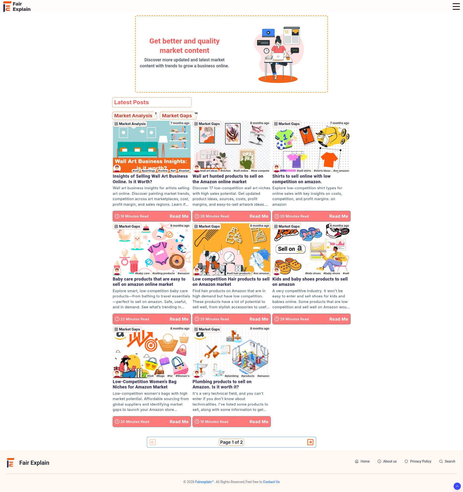
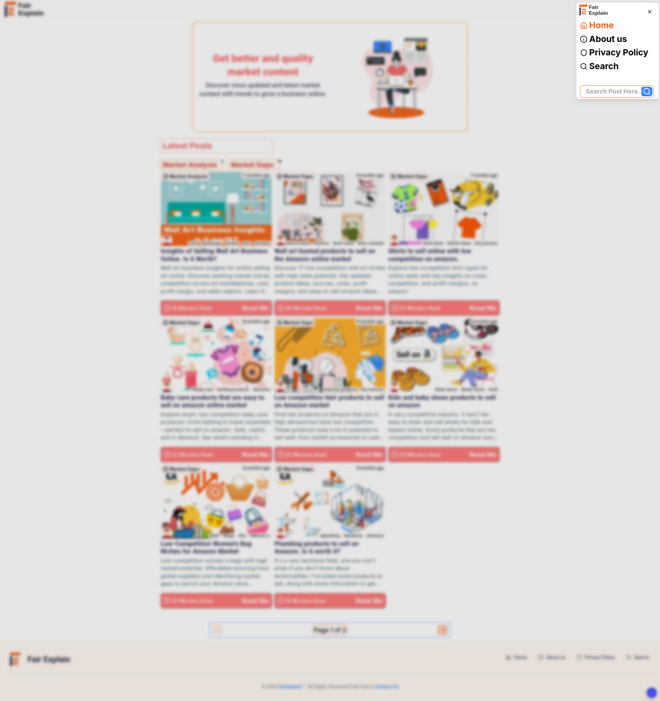
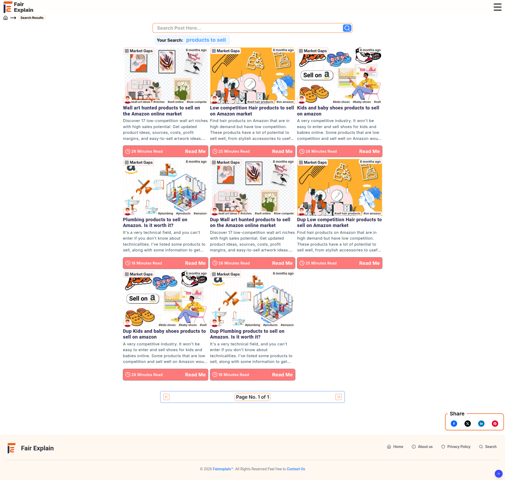
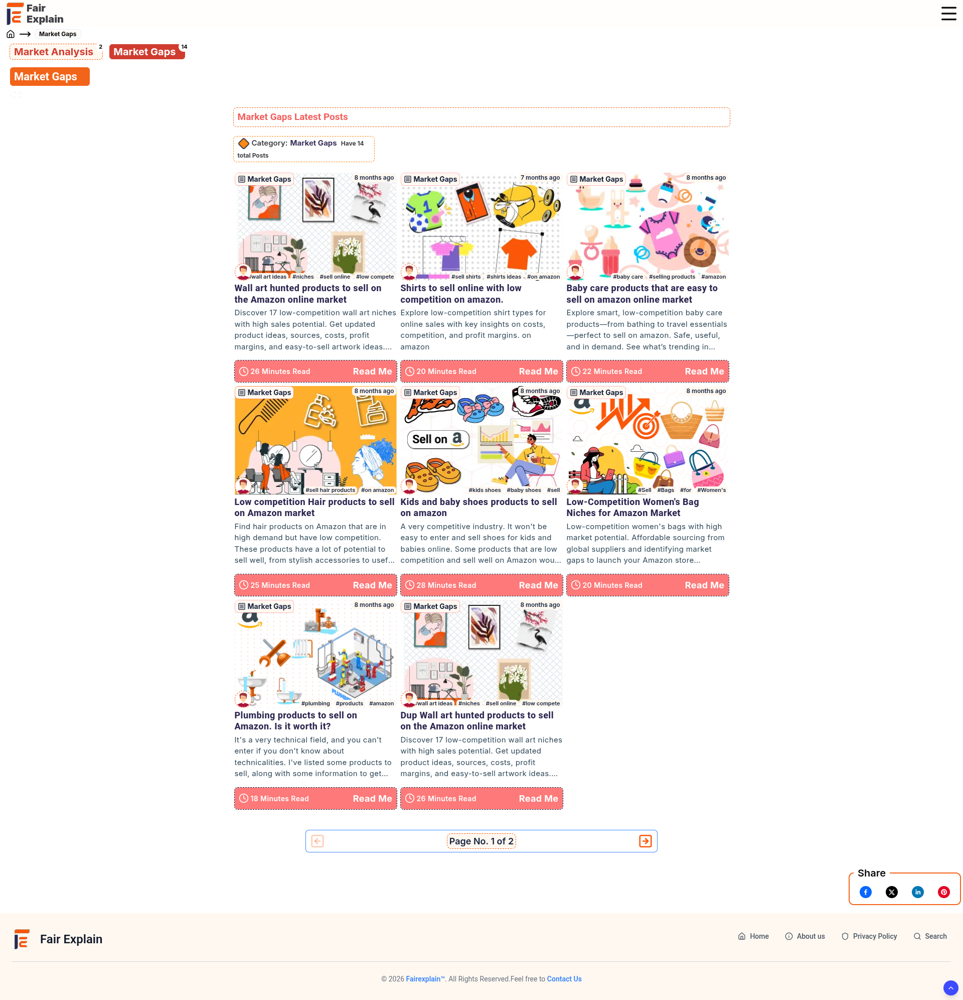
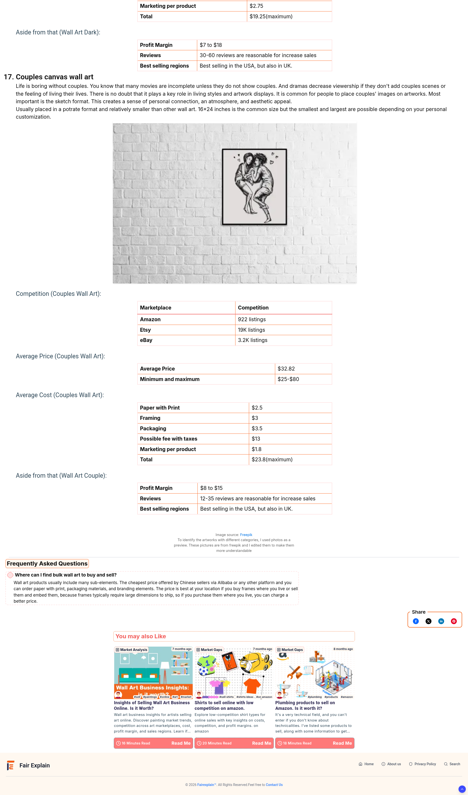
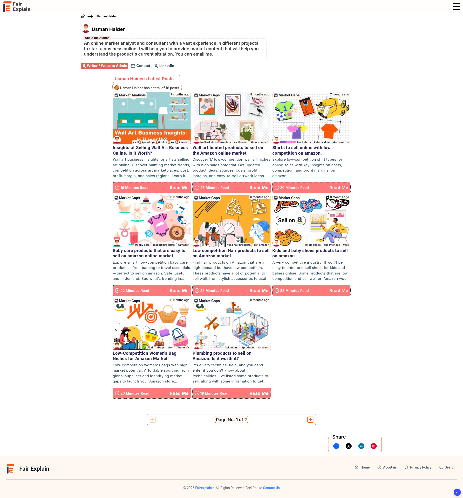
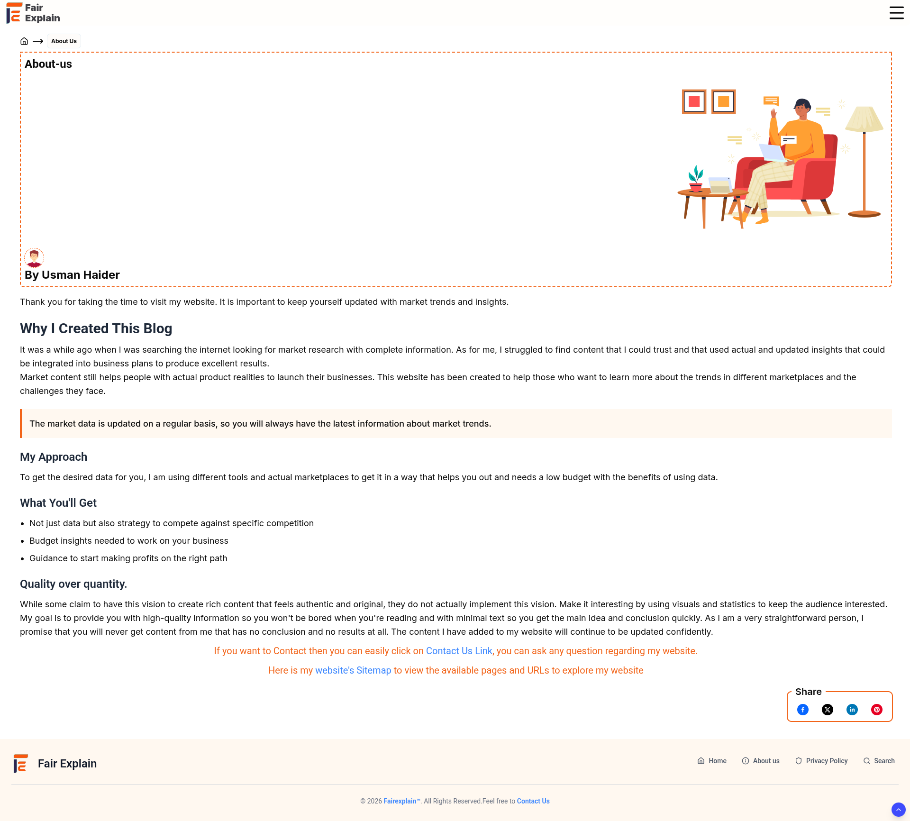

<div align="center">
  <h1>Next.js Blogging Platform</h1>
  
  <video src="Site_Screenshots/Blogging_Site_Intro.webm" autoplay loop muted playsinline width="100%"></video>
  <br />
  <p><i>A robust, SEO-optimized static blogging platform built leveraging the Next.js App Router.</i></p>
</div>

<br />

## 📸 Platform Interface Gallery

A visual overview of the platform's clean, minimalist, and responsive user interface.

### Home & Navigation Navigation
<p align="center">
  
  
</p>

### Content Discovery
<p align="center">
  
  
</p>

### Reading Experience
<p align="center">
  
  
</p>

### Authors & Information
<p align="center">
  
  
</p>

<hr />

## 🏗️ Technical Architecture

The application relies on Next.js static generation capabilities to serve content without requiring an external Content Management System (CMS) or database connection. All routing, layout structuring, and metadata generations are handled dynamically at build-time.

### Technology Stack

* **Core:** Next.js (App Router), React, TypeScript
* **Styling:** Tailwind CSS, Shadcn UI
* **UI Components:** Embla Carousel (Sliders), Lucide React (Icons), Base UI
* **Utilities:** `html-react-parser` (Content Rendering), `timeago.js` (Timestamp Formatting), `react-share` (Social Integration)

### Directory Structure

```text
.
├── app/                  # Application routing, layouts, and page views
│   ├── [categorySlug]/   # Dynamic routes for categories and posts
│   ├── authors/          # Author profiles
│   ├── search/           # Client-side search interface
│   └── api/              # Internal API endpoints
├── components/           # Reusable UI components and schemas
├── lib/                  # Utilities and local database (`localdb.json`)
├── public/               # Static assets (images, icons, fonts)
└── Site_Screenshots/     # Repository UI previews and demonstrations
```

## ⚙️ Configuration & Environment

Environment variables are defined to manage domain bindings and revalidation times. Refer to the `.env.example` file for the expected key-value pairs required in your deployment environment.

* `BASE_URL` / `NEXT_PUBLIC_BASE_URL`: Defines the absolute URL for canonical links and schema generation.
* `REVALIDATE_TIME`: Controls the Incremental Static Regeneration (ISR) caching intervals.

## 📄 License

This project is licensed under the MIT License - see the [LICENSE](LICENSE) file for details.
